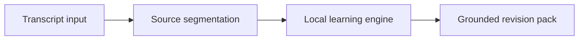

# LectureLens Edge

**A private, local-first study companion for turning lecture transcripts into
grounded revision material.**

[](https://github.com/Shahal17/LectureLens-Edge/actions/workflows/tests.yml)
[](LICENSE)
[](https://www.python.org/)

LectureLens Edge helps students revisit difficult lectures without sending the
lecture content to a third-party AI service. The current release accepts a
transcript, processes it locally, and produces source-linked notes, concepts,
review flags, quiz questions, and evidence-grounded answers.

The repository contains a working cross-platform local MVP. Optional on-device
speech and language-model adapters are part of the product roadmap, with a
Snapdragon NPU deployment profile documented separately.

## Why this project exists

Students can lose the thread of a lecture because of fast speech, unfamiliar
technical English, classroom noise, or unreliable internet. General meeting
assistants often require cloud upload and produce meeting minutes rather than
learning support.

LectureLens Edge is designed around three product principles:

1. **Local by default:** lecture content stays on the student's computer.
2. **Evidence before fluency:** every learning item should remain traceable to
   the transcript.
3. **Revision, not transcription alone:** the useful output is a study pack,
   not merely a block of text.

## What works today

- Local browser application served from `127.0.0.1`
- Transcript analysis with no mandatory third-party packages
- Extractive summary with stable source sentence IDs
- Key-concept extraction and English-Malayalam technical glossary
- Confusion Radar for dense explanations, contrasts, and exceptions
- Active-recall quiz generation
- Grounded question answering with refusal for unsupported questions
- High-contrast, large-text, reading-spacing, and speech-output controls
- Markdown and JSON export
- Privacy receipt showing zero external model calls in the local engine
- Automated unit tests and a repeatable reference-engine benchmark

## Quick start

Requirements: Python 3.10 or newer. The local MVP uses only the Python standard
library.

### Windows

```powershell
py run.py
```

You can also double-click `run_windows.bat`.

### macOS or Linux

```bash
python3 run.py
```

Open <http://127.0.0.1:8765> if the browser does not open automatically.

## Use the app

1. Enter a lecture title and subject.
2. Paste a transcript or select **Load sample lecture**.
3. Select **Analyse privately**.
4. Review the notes, key concepts, Confusion Radar, glossary, and quiz.
5. Ask a question about the lecture and inspect its source marker.
6. Export the revision pack when you want to keep it.

No account or network connection is required for this workflow.

## Product status

| Capability | Current local MVP | Planned on-device release |
|---|---|---|
| Input | Pasted or sample transcript | Microphone and audio-file transcription |
| Notes | Deterministic extractive engine | Local language model with grounding check |
| Question answering | Sentence retrieval with source ID | Local generated answer constrained to evidence |
| Quiz | Concept-based cloze questions | Local model generation with answer verification |
| Language support | Curated English-Malayalam glossary | Multilingual adapter |
| Storage | In-memory session and user-initiated export | Optional encrypted local session library |
| Hardware acceleration | Not required | Optional NPU/GPU runtime adapters |

The interface reports which engine is active. The project does not label the
portable engine as NPU inference or publish unmeasured hardware claims.

## Architecture



The HTTP server, analysis engine, and browser interface are deliberately
separated so a speech recognizer or local language model can replace one layer
without rewriting the whole product.

```text
LectureLens-Edge/
├── app/                         # Offline-capable browser interface
├── engine/                      # Local API, runtime detection, analysis engine
├── tests/                       # Standard-library unit tests
├── tools/                       # Repeatable local benchmark
├── config/                      # Optional model-adapter registry
├── docs/                        # Product, API, architecture, safety, roadmap
│   └── competition/             # Archived challenge-specific material
├── .github/                     # CI and contribution templates
├── run.py                       # Cross-platform launcher
├── run_windows.bat              # Windows launcher
└── LICENSE
```

See [Architecture](docs/ARCHITECTURE.md) for the component boundaries and
grounding strategy.

## API

The local server exposes three endpoints:

- `GET /api/health`
- `POST /api/analyze`
- `POST /api/ask`

Request and response examples are in [API documentation](docs/API.md).

## Tests and benchmark

```bash
python3 -m unittest discover -s tests -v
python3 tools/benchmark.py --runs 50 --json
```

The benchmark measures only the deterministic reference engine. It is not a
speech-recognition, LLM, or NPU benchmark.

## Privacy and responsible use

- The default server binds to `127.0.0.1`, not the local network.
- The current workflow uses no analytics, remote fonts, CDN scripts, or cloud
  model API.
- Nothing is saved unless the student exports it.
- Students should obtain permission before recording a lecture.
- Notes are study support, not an authoritative replacement for the lecturer or
  official course material.

Read [Responsible AI](docs/RESPONSIBLE_AI.md) and [Security Policy](SECURITY.md)
before deploying the project beyond personal use.

## Optional Snapdragon deployment

One planned deployment profile uses Qualcomm AI Hub Whisper-Base through ONNX
Runtime and the QNN execution provider, followed by a quantized local language
model. This is an optional acceleration path, not a requirement for using the
current product.

See [Snapdragon deployment plan](docs/SNAPDRAGON_DEPLOYMENT.md) for the adapter
contract and the measurements required before performance claims are made.

## Roadmap

The next product milestones are:

1. Add an adapter interface for speech recognition and local language models.
2. Connect real local audio transcription.
3. Add persistent sessions with explicit save and delete controls.
4. Test with students using varied subjects, accents, and classroom conditions.
5. Package the application for a simpler desktop installation.

The detailed plan and acceptance criteria are in [Roadmap](docs/ROADMAP.md).

## Documentation

- [API reference](docs/API.md)
- [Architecture and design decisions](docs/ARCHITECTURE.md)
- [Product roadmap](docs/ROADMAP.md)
- [Responsible AI notes](docs/RESPONSIBLE_AI.md)
- [User pilot guide](docs/USER_PILOT.md)
- [Snapdragon deployment plan](docs/SNAPDRAGON_DEPLOYMENT.md)
- [Archived competition material](docs/competition/README.md)

## Contributing

Bug reports, feature proposals, accessibility feedback, documentation fixes, and
small pull requests are welcome. Start with [CONTRIBUTING.md](CONTRIBUTING.md).

## Project history

LectureLens Edge began as an on-device AI challenge project. It is now maintained
as an independent learning-tool project. The original pitch and submission files
are preserved in `docs/competition/` for project history, but they do not define
the ongoing product roadmap.

## Author

Mohammed Shahal  
B.Tech Computer Science and Engineering, Artificial Intelligence and Machine
Learning  
MEA Engineering College, Kerala, India

## License

The source code is available under the [MIT License](LICENSE). Model weights and
third-party runtimes retain their own licences.
